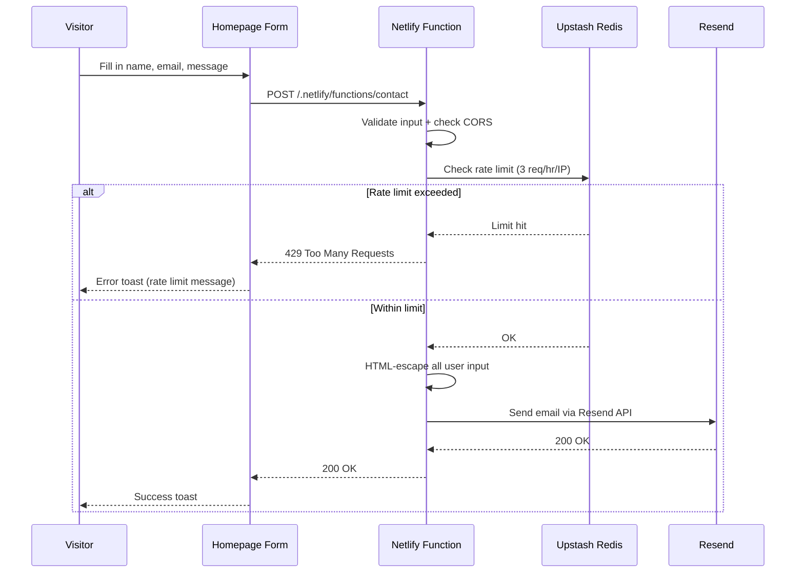
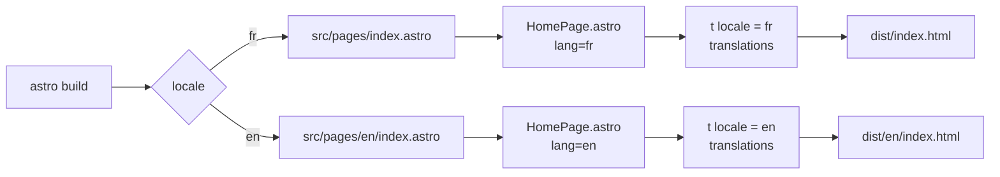
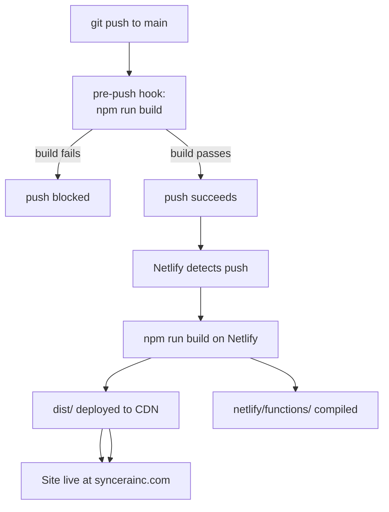

# Syncera — Project Documentation

**Syncèra Digitale Studio** is a bilingual (French/English) digital marketing agency website. Built as a static site with serverless functions for backend features.

- **Production URL:** https://syncerainc.com
- **Landing subdomain:** https://landing.syncerainc.com
- **Stack:** Astro 5 (SSG) + Tailwind CSS + Netlify Functions

---

## Table of Contents

1. [Tech Stack](#tech-stack)
2. [Directory Structure](#directory-structure)
3. [Pages & Routing](#pages--routing)
4. [i18n System](#i18n-system)
5. [Components](#components)
6. [Contact Form](#contact-form)
7. [Email Templates](#email-templates)
8. [Styling & Design System](#styling--design-system)
9. [Environment Variables](#environment-variables)
10. [Development Workflow](#development-workflow)
11. [Deployment](#deployment)
12. [Key Workflows](#key-workflows)

---

## Tech Stack

| Layer | Technology | Purpose |
|---|---|---|
| Framework | Astro 5 | Static site generation |
| CSS | Tailwind CSS 3 | Utility-first styling |
| Hosting | Netlify | CDN + serverless functions |
| Email | Resend | Transactional email sending |
| Rate limiting | Upstash Redis | Sliding window rate limiter |
| i18n | Custom (TypeScript) | French/English translations |
| Sitemap | @astrojs/sitemap | Auto-generated XML sitemap |

**Runtime dependencies:**
- `astro` ^5.18.1
- `@astrojs/tailwind` ^6.0.2
- `@astrojs/sitemap` ^3.7.2
- `resend` ^6.9.4
- `@upstash/ratelimit` ^2.0.8
- `@upstash/redis` ^1.37.0
- `tailwindcss` ^3.4.19

**Dev dependencies:**
- `netlify-cli` ^23.13.0 — local function testing
- `simple-git-hooks` ^2.13.1 — pre-push build check

---

## Directory Structure

```
Syncera/
├── netlify/
│   └── functions/
│       ├── contact.ts          # Contact form serverless function
│       └── email-template.ts   # HTML email builder
├── public/
│   ├── _redirects              # Netlify rewrite rules (landing subdomain)
│   ├── favicon.svg
│   └── sitemap-index.xml       # Auto-generated by Astro
├── src/
│   ├── components/
│   │   └── HomePage.astro      # Shared homepage component (all locales)
│   ├── i18n/
│   │   └── translations.ts     # All copy (FR + EN) + i18n helpers
│   ├── layouts/
│   │   └── Layout.astro        # Base HTML shell (<html>, <head>, <body>)
│   ├── pages/
│   │   ├── index.astro         # French homepage (/)
│   │   ├── en/
│   │   │   └── index.astro     # English homepage (/en/)
│   │   └── landing/
│   │       └── index.astro     # Standalone acquisition page
│   └── styles/
│       ├── global.css          # Tailwind directives + smooth scroll
│       └── landing.css         # Landing page animations + layout
├── astro.config.mjs            # Astro config (i18n, integrations, site URL)
├── netlify.toml                # Netlify build config
├── tailwind.config.mjs         # Custom theme (colors, fonts, safelist)
├── tsconfig.json               # TypeScript config (extends Astro strict)
├── .env.sample                 # Required environment variables template
└── package.json
```

---

## Pages & Routing

### URL Structure

| URL | File | Locale | Description |
|---|---|---|---|
| `/` | `src/pages/index.astro` | `fr` | French homepage (default) |
| `/en/` | `src/pages/en/index.astro` | `en` | English homepage |
| `/landing/` | `src/pages/landing/index.astro` | — | Standalone acquisition page |
| `landing.syncerainc.com` | → `/landing/` | — | Subdomain redirect via `_redirects` |

### Astro i18n Config (`astro.config.mjs`)

```js
i18n: {
  defaultLocale: 'fr',
  locales: ['fr', 'en'],
  routing: {
    prefixDefaultLocale: false,  // French at /, English at /en/
  },
}
```

### Subdomain Routing (`public/_redirects`)

All requests to `landing.syncerainc.com` are rewritten to the `/landing/` path, with static assets proxied correctly:

```
https://landing.syncerainc.com/_astro/*  /_astro/:splat  200
https://landing.syncerainc.com/favicon.svg  /favicon.svg  200
https://landing.syncerainc.com/*  /landing/:splat  200
```

---

## i18n System

All site copy lives in `src/i18n/translations.ts`. No copy is hardcoded in components.

### Locale Type

```ts
type Locale = 'fr' | 'en';
```

### Helper Functions

| Function | Signature | Purpose |
|---|---|---|
| `t(locale)` | `(locale: Locale) => Translations` | Returns translation object for locale |
| `getLocalePath(locale, hash?)` | `(locale: Locale, hash?: string) => string` | Builds correct URL (`/` or `/en/`) |
| `getAlternateLocale(locale)` | `(locale: Locale) => Locale` | Toggles between `fr` and `en` |

### Translation Keys

```
nav         Navigation links (home, about, services, contact)
hero        Hero section (tagline, subtitle, CTA button)
services    Four service cards (Signal, ScrollStop, Pulse, Orbit)
about       Company description, vision, approach
values      Three core values (Justesse, Engagement Sincère, Clarté)
contact     Form labels, placeholder text, submission states, error messages
footer      Copyright
```

### Adding a New Translation

1. Add the key to both `fr` and `en` objects in `translations.ts`
2. Consume via `t(locale).yourKey` in any `.astro` component

---

## Components

### `src/layouts/Layout.astro`

Base HTML shell. Accepts props for `title`, `description`, and `locale`. Sets `<html lang>`, loads global styles, and renders the page slot.

### `src/components/HomePage.astro`

The single shared homepage component. Accepts a `locale` prop and renders all sections using `t(locale)` for copy.

**Sections:**

| Section | ID | Description |
|---|---|---|
| Navigation | — | Fixed top bar, logo, language switcher, mobile hamburger |
| Hero | `#accueil` | Full-height banner, tagline, CTA button |
| Services | `#services` | 2-column grid of 4 service cards |
| About | `#a-propos` | Two-column layout with copy and images |
| Values | — | Dark background, 3 numbered value statements |
| Contact | `#contact` | Form (name, email, message) + toast feedback |
| Footer | — | Logo + copyright |

**Interactive behavior (inline `<script>`):**
- Mobile menu toggle
- Contact form submission via `fetch` to `/.netlify/functions/contact`
- Toast notification with 4-second auto-dismiss

### `src/pages/landing/index.astro`

Standalone acquisition/marketing page with its own layout and `src/styles/landing.css`. Not part of the i18n system. Optimized for conversion with fade-up animations and staggered entrance effects.

---

## Contact Form

### Frontend Flow

1. User fills in name, email, message and submits
2. Submit button disabled, shows "sending" state (from `data-*` i18n attributes)
3. `fetch` POST to `/.netlify/functions/contact` with JSON body
4. Response determines toast: success (green) / error or rate limit (red)
5. Toast auto-dismisses after 4 seconds

### Backend: `netlify/functions/contact.ts`

**Endpoint:** `POST /.netlify/functions/contact`

**Request body:**
```json
{ "name": "...", "email": "...", "message": "..." }
```

**Processing steps:**

1. CORS check — origin must match `ALLOWED_ORIGIN` env var
2. Method check — only `POST` and `OPTIONS` allowed
3. Input validation — all three fields required; email format validated
4. Rate limiting — 3 requests per hour per IP (Upstash sliding window)
5. HTML-escape all input (prevents XSS in email body)
6. Send email via Resend using `buildEmailHtml()` from `email-template.ts`

**Response codes:**

| Code | Meaning |
|---|---|
| 200 | Email sent successfully |
| 400 | Missing or invalid fields |
| 405 | Method not allowed |
| 429 | Rate limit exceeded (`Retry-After` header included) |
| 500 | Internal error (Resend failure, Redis failure) |

**Rate limit headers returned:**
- `X-RateLimit-Remaining`
- `Retry-After` (on 429 only)

---

## Email Templates

### `netlify/functions/email-template.ts`

**Function:** `buildEmailHtml(name, email, message): string`

**Security:** `escapeHtml()` escapes `&`, `<`, `>`, `"` in all user-supplied values before HTML insertion. Message newlines are converted to `<br>` tags.

**Template design:**
- Dark brown header (`#2d2319`) with "Syncera" wordmark
- Sender info card with name and clickable `mailto:` link
- Message body with proper line-break rendering
- Dark footer with reply instructions
- Color scheme matches main site (cream `#f0ebe1`, brown `#2d2319`, `#7a6654`)

---

## Styling & Design System

### Custom Tailwind Theme (`tailwind.config.mjs`)

**Colors:**

| Token | Hex | Usage |
|---|---|---|
| `cream` | `#f0ebe1` | Light page backgrounds |
| `cream-dark` | `#e8e2d6` | Section backgrounds |
| `brown-900` | `#2d2319` | Primary dark (header, footer) |
| `brown-800` | `#3d3027` | Dark backgrounds |
| `brown-700` | `#5c4a3a` | Mid-tone accents |
| `brown-600` | `#7a6654` | Lighter accents, borders |

**Fonts:**

| Token | Family | Usage |
|---|---|---|
| `font-serif` | Playfair Display, Georgia | Headings, hero |
| `font-sans` | Inter, system-ui | Body, UI |

**Safelisted classes** (prevent purging when added dynamically via JS):
- `bg-green-800`, `bg-red-800` — toast colors
- `translate-y-0`, `opacity-100` — toast animation states

### Global Styles (`src/styles/global.css`)

- Tailwind `@base`, `@components`, `@utilities` directives
- `scroll-behavior: smooth` on `html`
- Default body: Inter font, cream background, brown-900 text

### Landing Page Styles (`src/styles/landing.css`)

- CSS custom properties for the landing color scheme
- Noise overlay texture effect
- `.fade-up` animation with stagger delays (`.delay-1` through `.delay-5`)
- Responsive grid adjustments for pain points / solution cards
- Contact form styling independent from main site

---

## Environment Variables

See `.env.sample` for the full template. All variables are required for the contact function to work.

| Variable | Purpose | Example |
|---|---|---|
| `RESEND_API_KEY` | Resend API authentication | `re_...` |
| `EMAIL_FROM` | Sender address (must be verified in Resend) | `hello@syncerainc.com` |
| `EMAIL_TO` | Recipient for contact form emails | `owner@syncerainc.com` |
| `UPSTASH_REDIS_REST_URL` | Upstash Redis endpoint for rate limiting | `https://...upstash.io` |
| `UPSTASH_REDIS_REST_TOKEN` | Upstash Redis auth token | `AX...` |
| `ALLOWED_ORIGIN` | CORS allowed origin | `https://syncerainc.com` |

Set these in Netlify under **Site configuration → Environment variables** for production. For local development, create a `.env` file from `.env.sample`.

---

## Development Workflow

### Commands

```bash
npm run dev       # Start Astro dev server (localhost:4321)
npm run build     # Production build → dist/
npm run preview   # Preview production build locally
netlify dev       # Run with Netlify Functions (needed to test contact form)
```

> Use `netlify dev` (not `npm run dev`) whenever you need to test the contact form. It starts both the Astro dev server and the Netlify Functions runtime together.

### Git Hooks

A `pre-push` hook runs `npm run build` before every push. This prevents broken builds from reaching the remote. Managed by `simple-git-hooks`.

### Adding Content

**New translation strings:**
1. Add keys to both `fr` and `en` in `src/i18n/translations.ts`
2. Reference via `t(locale).newKey` in `HomePage.astro`

**New page:**
- French: `src/pages/your-page/index.astro`
- English: `src/pages/en/your-page/index.astro`
- Import and use `t(locale)` via the locale passed in frontmatter

**New component:**
- Add to `src/components/`
- Import in the relevant `.astro` page or layout

---

## Deployment

Deployed automatically on Netlify from the `main` branch.

### Build Config (`netlify.toml`)

```toml
[build]
  command = "npm run build"
  publish = "dist"

[build.environment]
  NODE_VERSION = "20"

[functions]
  directory = "netlify/functions"
```

### Deployment flow

1. Push to `main` triggers a Netlify build
2. `npm run build` runs Astro SSG → outputs to `dist/`
3. Netlify deploys `dist/` to CDN
4. `netlify/functions/` are compiled and deployed as serverless functions
5. `public/_redirects` rules are applied for subdomain routing

---

## Key Workflows

### Contact Form Submission



### Page Rendering (SSG)



### Language Switching

```mermaid
flowchart LR
    A[User on /] -->|clicks EN| B[getLocalePath en]
    B --> C[/en/]
    D[User on /en/] -->|clicks FR| E[getLocalePath fr]
    E --> F[/]
```

### Build & Deploy Pipeline


